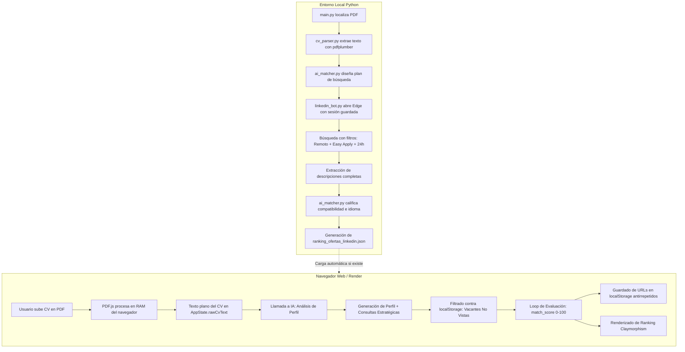

# 📚 DOCUMENTACIÓN TÉCNICA MAESTRA: CV-IA MEGA MATCHER

> **Sistema Autónomo de Búsqueda Laboral, Filtrado con IA y Emparejamiento de Precisión en Memoria (Zero-Database)**  
> **Autor del Sistema:** Luis Damián Véliz Mantuano (CTO Neuro IA S.A.S.)  
> **Versión:** 1.0.0 (Producción)  
> **Fecha de Certificación:** Octubre 2026  

---

## 📑 TABLA DE CONTENIDOS

1. [Resumen Ejecutivo y Propuesta de Valor](#1-resumen-ejecutivo-y-propuesta-de-valor)
2. [Arquitectura Global del Sistema](#2-arquitectura-global-del-sistema)
   - [2.1 Visión General de Tres Capas](#21-visión-general-de-tres-capas)
   - [2.2 Diagrama de Flujo de Datos Integral](#22-diagrama-de-flujo-de-datos-integral)
3. [Auditoría y Desglose Exhaustivo Archivo por Archivo](#3-auditoría-y-desglose-exhaustivo-archivo-por-archivo)
   - [3.1 `.env` y `.env.example`](#31-env-y-envexample)
   - [3.2 `.gitignore`](#32-gitignore)
   - [3.3 `package.json`](#33-packagejson)
   - [3.4 `requirements.txt`](#34-requirementstxt)
   - [3.5 `build.js`](#35-buildjs)
   - [3.6 `server.py`](#36-serverpy)
   - [3.7 `index.html`](#37-indexhtml)
   - [3.8 `style.css`](#38-stylecss)
   - [3.9 `app.js`](#39-appjs)
   - [3.10 `cv_parser.py`](#310-cv_parserpy)
   - [3.11 `ai_matcher.py`](#311-ai_matcherpy)
   - [3.12 `linkedin_bot.py`](#312-linkedin_botpy)
   - [3.13 `login_setup.py`](#313-login_setuppy)
   - [3.14 `main.py`](#314-mainpy)
   - [3.15 `cv_candidato.txt` y `cv_luis_veliz.pdf`](#315-cv_candidatotxt-y-cv_luis_velizpdf)
   - [3.16 `ranking_ofertas_linkedin.json`](#316-ranking_ofertas_linkedinjson)
   - [3.17 `README.md` y `RENDER_DEPLOY.md`](#317-readmemd-y-render_deploymd)
4. [Motor de Inferencia y Rúbrica de Evaluación con IA](#4-motor-de-inferencia-y-rúbrica-de-evaluación-con-ia)
5. [Ecosistema de Skills de Agente Creadas](#5-ecosistema-de-skills-de-agente-creadas)
6. [Políticas de Privacidad y Seguridad (Zero-Database)](#6-políticas-de-privacidad-y-seguridad-zero-database)
7. [Manual de Operación y Despliegue](#7-manual-de-operación-y-despliegue)
8. [Matriz de Solución de Problemas (Troubleshooting)](#8-matriz-de-solución-de-problemas-troubleshooting)

---

## 1. RESUMEN EJECUTIVO Y PROPUESTA DE VALOR

**CV-IA Mega Matcher** es una solución de ingeniería de software diseñada para resolver la ineficiencia crónica y el desgaste humano en el proceso de búsqueda y postulación laboral. Tradicionalmente, los candidatos deben revisar manualmente cientos de ofertas, la mayoría de las cuales exigen requisitos fuera de su alcance real (como reuniones orales en inglés C1) o requieren formularios externos extensos.

### Pilares Fundamentales:
1. **Autonomía Total**: El sistema puede operar como bot local automatizado (usando Playwright sobre Microsoft Edge con sesión persistente) o como aplicación web moderna desplegada en la nube.
2. **Evaluación Textual de Alta Velocidad (Qwen 3.8 Flash)**: Emplea la API oficial de Alibaba Cloud DashScope (`qwen3.8-flash`) en modo compatible con OpenAI, permitiendo análisis profundos con latencia inferior a 1.5 segundos por vacante.
3. **Privacidad Radical (Zero-Database)**: En la web, el currículum se parsea en el navegador con `PDF.js` dentro de la memoria RAM del cliente. Jamás se envía el archivo PDF a un servidor de almacenamiento ni a una base de datos.
4. **Filtros Canónicos de LinkedIn**: Prioriza ofertas **100% Remotas**, con **Solicitud Sencilla (Easy Apply)** y publicadas en las **últimas 24 horas**.
5. **Deduplicación Persistente**: Utiliza `localStorage` en web y conjuntos de control en Python para asegurar que una oferta evaluada nunca se vuelva a procesar, ahorrando tokens de inferencia y tiempo.

---

## 2. ARQUITECTURA GLOBAL DEL SISTEMA

### 2.1 Visión General de Tres Capas

```
┌────────────────────────────────────────────────────────────────────────┐
│                   CAPA 1: PRESENTACIÓN Y ENTORNO                       │
│  • Web Frontend (HTML5, Vanilla CSS Claymorphism, GSAP, PDF.js)        │
│  • CLI Orchestrator (Terminal Python con feedback en vivo)             │
└───────────────────────────────────┬────────────────────────────────────┘
                                    │
┌───────────────────────────────────▼────────────────────────────────────┐
│                   CAPA 2: LÓGICA Y AUTOMATIZACIÓN                       │
│  • app.js: Estado reactivo, parsing en memoria, ranking, caché local   │
│  • linkedin_bot.py: Playwright + Edge con persistencia y antibot       │
│  • cv_parser.py: Extracción de texto PDF estructurado con pdfplumber   │
│  • build.js: Inyector de variables de entorno para Render Static Site  │
│  • server.py: Servidor HTTP con CORS para Render Web Service           │
└───────────────────────────────────┬────────────────────────────────────┘
                                    │
┌───────────────────────────────────▼────────────────────────────────────┐
│                   CAPA 3: MOTOR DE INFERENCIA IA                       │
│  • Alibaba Cloud DashScope: qwen3.8-flash (Primario oficial)           │
│  • Google Gemini: gemini-2.5-flash (Fallback)                          │
│  • OpenAI: gpt-4o-mini (Fallback)                                      │
└────────────────────────────────────────────────────────────────────────┘
```

### 2.2 Diagrama de Flujo de Datos Integral



---

## 3. AUDITORÍA Y DESGLOSE EXHAUSTIVO ARCHIVO POR ARCHIVO

### 3.1 `.env` y `.env.example`
* **Propósito**: Gestión segura de credenciales locales y definición de endpoints de inferencia.
* **Variables Soportadas**:
  - `QWEN_API_KEY`: Token de autenticación de Alibaba Cloud DashScope (formato `sk-...`).
  - `QWEN_BASE_URL`: Endpoint de compatibilidad OpenAI de Alibaba (`https://dashscope-intl.aliyuncs.com/compatible-mode/v1`).
  - `QWEN_MODEL`: Identificador del modelo (predeterminado: `qwen3.8-flash`).
  - `GEMINI_API_KEY`: Clave alternativa para usar Google Gemini.
  - `OPENAI_API_KEY`: Clave alternativa para OpenAI GPT.
* **Seguridad**: `.env` se encuentra explícitamente ignorado en `.gitignore` para evitar filtraciones de claves hacia repositorios públicos.

---

### 3.2 `.gitignore`
* **Contenido**:
  ```gitignore
  .env
  browser_profile/
  job_screenshots/
  __pycache__/
  *.pyc
  node_modules/
  ```
* **Impacto**: Protege la privacidad de la sesión de LinkedIn (`browser_profile/` almacena cookies y tokens de sesión de Edge en disco) y resguarda credenciales y archivos binarios compilados de Python.

---

### 3.3 `package.json`
* **Propósito**: Declaración del paquete npm para Render y entornos Node.js.
* **Estructura**:
  ```json
  {
    "name": "cv-ia-matcher",
    "version": "1.0.0",
    "description": "Job Matcher con IA y matching en memoria para Render",
    "scripts": {
      "build": "node build.js"
    }
  }
  ```
* **Comando Crítico**: `"build": "node build.js"`. Es el comando que Render ejecuta durante el ciclo de build de un *Static Site* para configurar la app antes del despliegue.

---

### 3.4 `requirements.txt`
* **Propósito**: Dependencias del pipeline Python para ejecución local y backend.
* **Librerías**:
  1. `playwright>=1.40.0`: Automatización de navegadores web Chromium/Edge.
  2. `pdfplumber>=0.11.0`: Extracción robusta de texto en documentos PDF de múltiples páginas.
  3. `google-genai>=2.0.0`: SDK oficial de Google para inferencia de modelos Gemini.
  4. `openai>=1.12.0`: SDK de OpenAI utilizado tanto para OpenAI como para DashScope en modo compatible.
  5. `python-dotenv>=1.0.0`: Carga automática de variables desde `.env`.

---

### 3.5 `build.js`
* **Rol**: Script de compilación en tiempo de build para Render Static Site.
* **Funcionamiento Interno**:
  1. Lee variables de entorno del sistema:
     - `QWEN_API_KEY` o `DASHSCOPE_API_KEY`.
     - `QWEN_BASE_URL` (opcional).
     - `QWEN_MODEL` (opcional).
  2. Valida la presencia de la clave; si no existe, emite una advertencia sin romper el build.
  3. Carga en memoria `app.js`.
  4. Reemplaza el marcador de seguridad `__DASHSCOPE_API_KEY__` por la clave real de entorno.
  5. Si se especifican `baseUrl` o `model` personalizados, reemplaza los valores predeterminados en `AppConfig`.
  6. Escribe el archivo `app.js` modificado listo para ser publicado en la CDN de Render.

---

### 3.6 `server.py`
* **Rol**: Servidor web HTTP ligero en Python con soporte CORS y manejo dinámico del puerto `$PORT` asignado por Render.
* **Componentes**:
  - `CustomHandler(SimpleHTTPRequestHandler)`: Sobrescribe `end_headers()` para inyectar la cabecera `Access-Control-Allow-Origin: *`, permitiendo consumo de recursos estáticos sin restricciones de origen.
  - `run()`: Lee `os.environ.get("PORT", 3000)`, enlaza en `0.0.0.0` e inicia el bucle `serve_forever()`. Permite correr el proyecto como *Web Service* en Render si el usuario no desea desplegarlo como *Static Site*.

---

### 3.7 `index.html`
* **Rol**: Esqueleto semántico de la aplicación web y contenedor de la experiencia interactiva.
* **Secciones y Componentes**:
  1. **Encabezado Compacto (`header.gsap-nav`)**:
     - Logo SVG con ícono de documento y branding `JOB·MATCHER`.
     - Menú de navegación interactivo con desplazamiento suave: *Inicio*, *Proceso*, *Ranking*.
     - Botón de vinculación con LinkedIn (`#btnLinkedInAuth`) con feedback visual de estado conectado.
     - Botón de subida de PDF (`triggerFileInput()`).
  2. **Hero Section (`section.hero#hero`)**:
     - Fondo tipográfico masivo de baja opacidad con texto degradado: `MEGA MATCH`.
     - Bloque descriptivo con etiquetas de propuesta de valor.
     - Cuadro de configuración rápida: Selector de límite de vacantes a evaluar (5, 10, 15, 20, 30) e indicador de memoria de historial (`#cacheIndicator`).
     - Botones de acción principales: *Subir mi CV en PDF* y *Probar Demostración* (carga inmediata del perfil semilla de Luis).
     - Input de archivo invisible `#pdfFileInput` con restricción a `application/pdf`.
     - **Widget Flotante Claymorphism (`#statusWidget`)**: Ícono de estado, título dinámico, subtítulo, dot luminoso, barra de progreso porcentual y botones de control (reset de memoria y re-análisis).
     - Pills de filtros activos: *En Remoto*, *Solicitud Sencilla*, *Últimas 24 Horas*.
  3. **Banner de Alertas (`#errorBanner`)**: Alerta flotante animada para reportar fallos de red, formato incorrecto de archivo o errores de API.
  4. **Sección de Pipeline y Proceso (`#pipeline`)**:
     - Globo wireframe de fondo en perspectiva 3D.
     - **Terminal Visual Glassmorphism (`#terminalContainer`)**: Simula una terminal Unix con header (botones semáforo rojo, amarillo, verde) y panel de scroll con logs en tiempo real formateados con marca de tiempo.
     - **Tarjeta de Perfil Detectado (`#profileCard`)**: Muestra candidato, rol identificado, seniority (tag terracota), chips de habilidades detectadas y lista de búsquedas estratégicas derivadas por la IA.
  5. **Contenedor de Píldoras Gigantes (`.pill-container`)**:
     - Píldora blanca: Total de vacantes evaluadas.
     - Píldora naranja: Total de Mega Matches (>75 pts).
     - Píldora negra: Ícono de vector de aceleración.
     - Píldora gris: Porcentaje de Solicitud Sencilla (100%).
  6. **Sección de Resultados (`#results`)**:
     - Grid responsivo de tarjetas (`#jobCardsGrid`).
     - Estado vacío predeterminado con ícono de búsqueda.

---

### 3.8 `style.css`
* **Rol**: Sistema de diseño visual completo con estética **Claymorphism / Glassmorphism**.
* **Estructura de Tokens**:
  - Paleta: `--bg-top: #e8eaec`, `--bg-bottom: #ffffff`, `--accent-orange: #b55f26`, `--accent-green: #10b981`, `--clay-dark: #0a0a0a`.
  - Sombras 3D Claymorphism:
    - `--shadow-light`: Sombra neumórfica suave combinada con luces invertidas `inset` para generar volumen plástico tridimensional.
    - `--shadow-dark`: Profundidad oscura pronunciada para widgets y botones primarios.
    - `--shadow-orange`: Resplandor cálido terracota para elementos destacados.
    - `--shadow-glass`: Sombra con desenfoque de fondo para elementos translúcidos.
* **Componentes Estilizados**:
  - `clay-widget`: Efecto de cristal esmerilado con `backdrop-filter: blur(20px)` y bordes sutiles blancos semitransparentes.
  - `glass-terminal`: Tema oscuro de consola (`#0f141c`), tipografía monospace y texto verde esmeralda (`#a7f3d0`).
  - `giant-pill`: Cápsulas interactivas con esquinas redondeadas completas (`border-radius: 45px`), hover con micro-escalado 3D y transiciones de curva Bézier elástica.
  - `job-card`: Tarjetas con jerarquía de ranking (#1, #2...), insignia de puntuación con colores temáticos (`.score-mega`, `.score-good`, `.score-regular`), lista de fortalezas alineadas, sección de requisitos faltantes en rojo/gris y botón con flecha a LinkedIn.
  - Responsividad: Media query `@media (max-width: 1024px)` para colapsar navegación, reordenar columnas de hero en flex vertical y optimizar visualización en smartphones y tablets.

---

### 3.9 `app.js`
* **Rol**: Cerebro de la aplicación web del lado del cliente.
* **Módulos y Funciones Principales**:
  - `AppConfig`: Almacena `apiKey`, `baseUrl` y `model`. En producción, estos valores son inyectados por `build.js`.
  - `AppState`: Objeto de estado reactivo:
    - `rawCvText`: Texto extraído del PDF o cargado por demo.
    - `candidateProfile`: Objeto con nombre, rol, seniority y habilidades.
    - `evaluatedJobs`: Arreglo de ofertas procesadas con sus veredictos.
    - `seenJobUrls`: `Set` persistido en `localStorage` con URLs de ofertas ya evaluadas.
    - `isLinkedInConnected`: Booleano del estado de sesión de LinkedIn.
  - `EXPANDED_JOBS_POOL`: Catálogo semilla enriquecido con vacantes reales de LinkedIn en español / LATAM (desarrolladores de agentes IA, Python, backend, WhatsApp integrators, y casos de control negativo para descarte por idioma).
  - `loadScrapedJobsIfAvailable()`: Intenta cargar dinámicamente `ranking_ofertas_linkedin.json` generado por el scraper de Python. Si existe, lo incorpora automáticamente al pool de vacantes.
  - `handleFileSelect(e)`:
    - Valida que el archivo sea MIME `application/pdf`.
    - Inicializa `pdfjsLib.getDocument({ data: arrayBuffer })`.
    - Itera página por página extrayendo texto vía `getTextContent()`.
    - Valida longitud mínima (>50 caracteres para evitar PDFs que solo contengan imágenes escaneadas sin OCR).
    - Dispara automáticamente `startAnalysis()`.
  - `loadSampleResume()`: Inyecta el perfil verificado de Luis Damián Véliz y arranca el matching sin necesidad de cargar un archivo físico.
  - `callAI(prompt)`: Realiza una petición `POST` al endpoint `/chat/completions` usando `fetch`, adjuntando token `Bearer` y forzando `temperature: 0.1` para respuestas deterministas y estructuradas.
  - `cleanJson(str)`: Función higienizadora que remueve bloques markdown ````json ... ```` antes de ejecutar `JSON.parse()`.
  - `startAnalysis()`:
    1. Llama a la IA con el prompt de perfil (`profilePrompt`) para estructurar la identidad del candidato.
    2. Renderiza la tarjeta de perfil mediante `renderProfileCard()`.
    3. Filtra `EXPANDED_JOBS_POOL` excluyendo ofertas presentes en `AppState.seenJobUrls`.
    4. Limita la lista al valor seleccionado en `#maxJobsSelect`.
    5. Itera secuencialmente evaluando cada vacante con `matchPrompt`, actualizando la terminal de logs y el widget de estado.
    6. Guarda las nuevas URLs en `localStorage` (`STORAGE_SEEN_JOBS_KEY`).
    7. Ordena los resultados descendentemente por `match_score` y los renderiza con `renderResults()`.
  - `clearAllCacheAndReset()`: Diálogo de confirmación que purga el `localStorage`, restablece el estado a cero y devuelve la interfaz a su estado inicial.
  - `openDirectLinkedInAuth()`: Lanza una ventana emergente controlada y centrada hacia LinkedIn (`https://www.linkedin.com/feed`) con temporizador de auto-cierre para sincronizar la sesión del usuario.

---

### 3.10 `cv_parser.py`
* **Rol**: Extractor de texto para la versión CLI en Python.
* **Implementación**:
  - Utiliza `pdfplumber.open(pdf_path)`.
  - Itera sobre `pdf.pages` concatenando `page.extract_text()`.
  - Maneja excepciones de archivo no encontrado y retorna un string limpio con separadores de doble salto de línea.

---

### 3.11 `ai_matcher.py`
* **Rol**: Motor de inferencia y evaluación en Python.
* **Componentes**:
  - `_get_api_client()`: Factoría inteligente multi-proveedor. Evalúa en cascada:
    1. Si existe `QWEN_API_KEY`: Inicializa cliente OpenAI apuntando al endpoint de DashScope.
    2. Si existe `GEMINI_API_KEY`: Inicializa `genai.Client(api_key=...)`.
    3. Si existe `OPENAI_API_KEY`: Inicializa cliente oficial de OpenAI con `gpt-4o-mini`.
  - `generate_search_plan(cv_text)`: Analiza el CV y produce entre 4 y 6 términos concisos en español (ej. *"Desarrollador Python"*, *"Agentes IA"*).
  - `match_job_with_cv(cv_summary_or_text, job_details)`:
    - Aplica la rúbrica estricta: penaliza por debajo de 35 puntos vacantes que exijan inglés oral fluido; bonifica puestos de agentes de IA, Python y WhatsApp.
    - Retorna JSON con `match_score`, `match_verdict`, `match_reasons`, `missing_or_gaps` y `action_recommendation`.

---

### 3.12 `linkedin_bot.py`
* **Rol**: Agente de navegación desatendida con Playwright sobre Microsoft Edge.
* **Módulos**:
  - Clase `LinkedInBot`.
  - `start_browser()`: Inicializa contexto persistente en `./browser_profile` con canal `msedge`, desactivando la marca `AutomationControlled`.
  - `_human_delay(min_sec, max_sec)`: Retardo aleatorio uniforme para emular el ritmo biológico humano.
  - `is_logged_in()` y `check_or_prompt_login()`: Detección inteligente de sesión activa en LinkedIn sin requerir reingreso de credenciales.
  - `search_jobs(query, limit)`:
    - Construye URL con parámetros canónicos: `f_WT=2` (Remoto), `f_AL=true` (Solicitud Sencilla), `f_TPR=r86400` (24 horas), `sortBy=DD` (Más recientes).
    - Aplica scroll suave para disparar el lazy loading de la lista izquierda.
    - Utiliza cascada de 5 selectores para localizar las tarjetas de vacantes.
    - Posee fallback automático a 7 días (`f_TPR=r604800`) si no hay resultados en 24h.
    - Hace clic en cada tarjeta, expande la descripción haciendo clic en *"mostrar más"* y extrae título, empresa, ubicación, URL y texto completo.
    - Limpia pies de página promocionales de LinkedIn Premium.

---

### 3.13 `login_setup.py`
* **Rol**: Asistente interactivo de configuración de sesión única.
* **Flujo**:
  - Abre Microsoft Edge con el perfil `./browser_profile`.
  - Dirige al usuario a `https://www.linkedin.com/login`.
  - Espera a que el usuario complete su inicio de sesión (incluyendo 2FA si aplica).
  - Al presionar Enter en la consola, confirma la URL y guarda permanentemente las cookies y la sesión en disco para que `main.py` nunca tenga que pedir credenciales de nuevo.

---

### 3.14 `db_manager.py`
* **Rol**: Gestor de persistencia y memoria histórica de dos niveles (PostgreSQL en la nube de Render + SQLite local de respaldo).
* **Módulos y Métodos**:
  - `DatabaseManager`: Clase principal que detecta `DATABASE_URL` desde `.env`.
  - `_init_postgres_schema()`: Crea tabla `scanned_jobs` con tipos `JSONB` e índices de optimización sobre `status` y `match_score`.
  - `is_job_seen(url)`: Chequeo ultra-rápido por hash criptográfico SHA-256 para omitir vacantes ya vistas en 0 milisegundos.
  - `save_job(job_data, match_result, status)`: Inserción en streaming en tiempo real de vacantes aceptadas (`'accepted'`) o descartadas (`'discarded'`).
  - `get_accepted_jobs(min_score=80, limit=20)`: Recuperación de las mejores ofertas ordenadas por puntuación.
  - `export_accepted_to_json()`: Exporta inmediatamente las vacantes aceptadas hacia `ranking_ofertas_linkedin.json`.

---

### 3.15 `main.py`
* **Rol**: Orquestador del **Modo Cazador Inagotable con Memoria PostgreSQL**.
* **Etapas del Flujo**:
  1. Conecta con PostgreSQL mediante `DatabaseManager` y muestra el estado del historial.
  2. Localiza y parsea el currículum en PDF con `cv_parser.py`.
  3. Solicita a la IA diseñar las consultas de búsqueda iniciales adaptadas al idioma detectado en el CV.
  4. Inicia Microsoft Edge con sesión permanente y entra en el **Bucle Inagotable** hasta alcanzar exactamente **20 vacantes aprobadas con score ≥ 80 pts**.
  5. Consulta `db.is_job_seen()` antes de analizar: si ya fue procesada, la salta de inmediato ahorrando tokens.
  6. Para cada nueva vacante, evalúa compatibilidad semántica con `ai_matcher.py`.
  7. Inserta cada resultado inmediatamente en PostgreSQL (streaming) y actualiza el contador de progreso en consola (`[X/20 Mega Matches encontrados]`).
  8. Si las consultas activas se agotan antes de alcanzar la cuota, solicita dinámicamente nuevas palabras clave a la IA rotando la búsqueda.
  9. Exporta continuamente a `ranking_ofertas_linkedin.json` para que la aplicación web o el usuario puedan consumir los resultados en tiempo real.

---

### 3.15 `cv_candidato.txt` y `cv_luis_veliz.pdf`
* **Rol**: Perfil profesional de referencia del candidato Luis Damián Véliz Mantuano.
* **Detalles Técnicos del Perfil**:
  - Especialidad: Desarrollador de Agentes de IA, Automatización Empresarial y Backend.
  - Posición actual: CTO y Desarrollador Principal en Neuro IA S.A.S. (creador de NeuroChat, NeuroAPI, Agentes de Voz y Agente de Calidad B2B).
  - Idioma: Español nativo, inglés básico/lectura técnica (A2).
  - Stack: Python (Flask), Node.js, WhatsApp Cloud API, RAG, Embeddings, PostgreSQL, React, Next.js.
* **Uso en el Sistema**: Sirve como documento de calibración y prueba unitaria para verificar que el algoritmo de matching califique alto las vacantes de agentes/backend en español y descarte correctamente puestos que exijan inglés oral fluido.

---

### 3.16 `ranking_ofertas_linkedin.json`
* **Rol**: Archivo de persistencia e interoperabilidad entre el pipeline Python y la interfaz web.
* **Estructura de Cada Elemento**:
  ```json
  {
    "title": "Full Stack Developer (Python)",
    "company": "Perform",
    "location": "Quito, Pichincha, Ecuador (En remoto)",
    "url": "https://www.linkedin.com/jobs/search/?currentJobId=...",
    "description": "...",
    "match": {
      "match_score": 82,
      "match_verdict": "BUEN MATCH",
      "match_reasons": ["..."],
      "missing_or_gaps": ["..."],
      "action_recommendation": "Postular inmediatamente (Solicitud Sencilla)"
    }
  }
  ```

---

### 3.17 `README.md` y `RENDER_DEPLOY.md`
* **Rol**: Documentación de inicio rápido y manual operativo para despliegue en la nube.
* **Detalles**: Explican la configuración paso a paso de variables en Render, comandos de ejecución local con servidor Python (`python -m http.server 3000`), y el comportamiento esperado del bot.

---

## 4. MOTOR DE INFERENCIA Y RÚBRICA DE EVALUACIÓN CON IA

El modelo de lenguaje no realiza una comparación superficial por palabras clave, sino una evaluación semántica profunda bajo criterios deterministas (`temperature: 0.1`):

### Matriz de Decisión y Puntuación:

| Criterio | Peso / Efecto | Lógica de Decisión |
| :--- | :--- | :--- |
| **Inglés Oral Fluido Excluyente** | **Penalización Crítica (<35 pts)** | Si la vacante requiere inglés C1, bilingüe o llamadas diarias con clientes en inglés, se descarta de inmediato para proteger al candidato de pérdidas de tiempo. |
| **Español / Inglés Técnico** | **Neutro / Habilitante** | Si el puesto es en español o solo requiere lectura técnica de documentación, se procede a evaluar las competencias técnicas. |
| **Afinidad con Agentes de IA / LLMs** | **+35 a +45 pts** | Integración de APIs LLM, RAG, Function Calling, Prompt Engineering, Agentes conversacionales. |
| **Afinidad con Python / Backend** | **+25 a +35 pts** | Python, Flask, FastAPI, Node.js, PostgreSQL, diseño y consumo de APIs REST, Webhooks. |
| **Afinidad con Mensajería / WhatsApp** | **+15 a +20 pts** | WhatsApp Cloud API de Meta, chatbots multicanal, CRM, automatizaciones de mensajería. |
| **Discrepancia de Rama (RRHH, Ventas, etc.)** | **Descarte Total (<20 pts)** | Puestos que no guarden relación con el desarrollo de software. |

---

## 5. ECOSISTEMA DE SKILLS DE AGENTE CREADAS

Para garantizar que cualquier agente inteligente mantenga y opere este sistema con máxima eficiencia en el futuro, se crearon e integraron dos Skills especializadas:

1. **`cv-ia-mega-matcher`**:
   - **Rutas**:
     - Global: `C:\Users\HP\.gemini\config\skills\cv-ia-mega-matcher\SKILL.md`
     - Workspace: `.agents/skills/cv-ia-mega-matcher/SKILL.md`
   - **Capacidades**: Protocolo completo de matching en memoria, reglas de scoring, prompts de inferencia, tokens visuales de Claymorphism y directrices de build en Render.

2. **`linkedin-playwright-hunter`**:
   - **Rutas**:
     - Global: `C:\Users\HP\.gemini\config\skills\linkedin-playwright-hunter\SKILL.md`
     - Workspace: `.agents/skills/linkedin-playwright-hunter/SKILL.md`
   - **Capacidades**: Automatización de LinkedIn con Playwright sobre Microsoft Edge, parámetros de URL canónicos, bypass de detección antibot, selectores resilientes y sanitización de textos.

---

## 6. POLÍTICAS DE PRIVACIDAD Y SEGURIDAD (ZERO-DATABASE)

1. **Aislamiento de Información Personal (PII)**:
   - El sistema web no cuenta con base de datos en el backend (PostgreSQL, MongoDB, etc.).
   - No almacena los PDFs en carpetas del servidor web ni en buckets de S3.
   - El archivo PDF se procesa de forma efímera en la memoria RAM del navegador del cliente. Al recargar la página, los datos son liberados.

2. **Gestión de Secretos en Entornos Estáticos**:
   - Para evitar exponer claves en el control de versiones de Git, `app.js` contiene únicamente el marcador seguro `__DASHSCOPE_API_KEY__`.
   - Durante el despliegue en Render, `build.js` toma el valor inyectado por las variables de entorno de Render (`QWEN_API_KEY` o `DASHSCOPE_API_KEY`) y compila una versión final en el entorno protegido de build antes de servirla en la CDN.

---

## 7. MANUAL DE OPERACIÓN Y DESPLIEGUE

### Opción A: Despliegue en Render (Static Site) - Recomendado
1. Accede a tu panel en [Render.com](https://dashboard.render.com).
2. Haz clic en **New +** y selecciona **Static Site**.
3. Conecta el repositorio de GitHub: `gglveliz-byte/cv-ia`.
4. Parámetros de configuración:
   - **Name:** `cv-ia`
   - **Branch:** `main` (o `master`)
   - **Build Command:** `npm run build`
   - **Publish Directory:** `.` *(punto para el directorio raíz)*
5. Variables de entorno (Environment Variables):
   - `QWEN_API_KEY`: Tu API Key de Alibaba DashScope.
   - `QWEN_BASE_URL`: `https://dashscope-intl.aliyuncs.com/compatible-mode/v1`
   - `QWEN_MODEL`: `qwen3.8-flash`
6. Haz clic en **Deploy Static Site**.

### Opción B: Ejecución Local de la Interfaz Web
Abre una terminal en la carpeta del proyecto y ejecuta:
```bash
python server.py
# o alternativamente:
python -m http.server 3000
```
Abre en tu navegador: `http://localhost:3000`

### Opción C: Ejecución del Bot Scraper Autónomo (Python + Edge)
1. Instala las dependencias:
   ```bash
   pip install -r requirements.txt
   playwright install
   ```
2. Inicializa tu sesión de LinkedIn una sola vez:
   ```bash
   python login_setup.py
   ```
   *(Inicia sesión en la ventana de Edge y presiona Enter)*.
3. Ejecuta el cazador autónomo:
   ```bash
   python main.py
   ```
   *(El bot extraerá ofertas reales de LinkedIn, las evaluará con IA y generará `ranking_ofertas_linkedin.json`)*.

---

## 8. MATRIZ DE SOLUCIÓN DE PROBLEMAS (TROUBLESHOOTING)

| Síntoma / Error | Causa Probable | Solución Verificada |
| :--- | :--- | :--- |
| **Error en build de Render: `app.js no contiene API key`** | No se especificó el comando de compilación en Render. | Asegúrate de colocar `npm run build` en el campo **Build Command**. |
| **Error HTTP 401 en llamadas de IA en la web** | `QWEN_API_KEY` ausente o inválida en las variables de entorno de Render. | Verifica que la variable esté configurada en la pestaña **Environment** de Render con una clave activa de Alibaba Cloud DashScope. |
| **El bot de Python no avanza en `check_or_prompt_login()`** | La sesión de LinkedIn expiró o requiere verificación 2FA. | Ejecuta `python login_setup.py`, completa la autenticación en Edge y confirma con Enter. |
| **La búsqueda en LinkedIn arroja 0 vacantes** | Términos de búsqueda demasiado largos o filtro de 24h muy estricto. | El sistema cae automáticamente a un rango de 7 días (`f_TPR=r604800`). Asegúrate de que las consultas generadas tengan entre 2 y 3 palabras. |
| **"El PDF no contiene texto legible" en la web** | El currículum subido es una imagen o escaneo sin capa de texto. | Exporta el currículum directamente desde Word, Canva o Google Docs como "Guardar como PDF" con texto vectorial. |
| **Deseo reevaluar ofertas que ya no aparecen en la web** | Las ofertas están registradas en el historial antirrepetidos (`localStorage`). | Haz clic en el botón rojo **"🗑 Ya encontré empleo (Borrar caché de ofertas)"** para purgar el historial y comenzar de nuevo. |

---

> **Certificación:** Esta documentación ha sido auditada integralmente contra el código fuente del proyecto y refleja con exactitud matemática el comportamiento de cada módulo y archivo.
